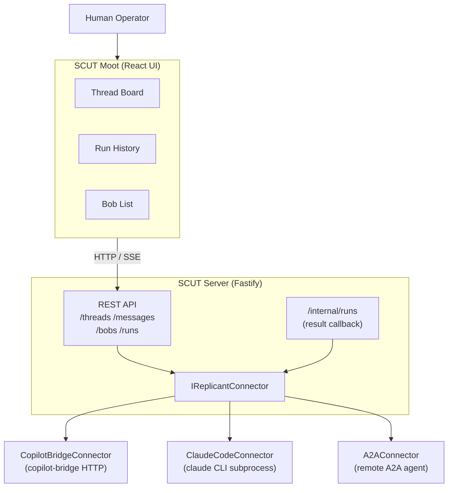
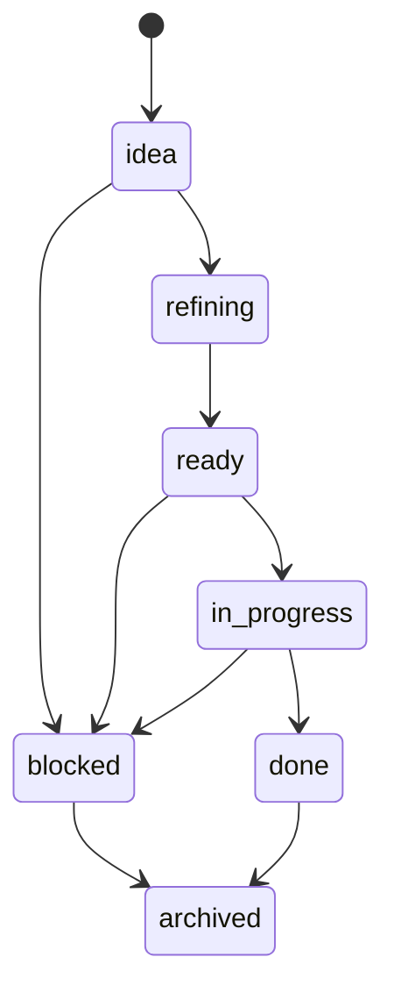
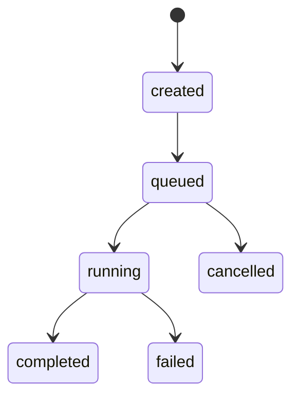

# SCUT - Design Specification

## Table of Contents

1. [Executive Summary](#1-executive-summary)
2. [Vocabulary](#2-vocabulary)
3. [Architecture Diagram](#3-architecture-diagram)
4. [Data Model](#4-data-model)
5. [Connector Interface](#5-connector-interface)
6. [API Surface](#6-api-surface)
7. [Connector Implementations (Planned)](#7-connector-implementations-planned)
8. [Phase Plan](#8-phase-plan)

---

## 1. Executive Summary

SCUT (Structured Coordination Utility for Tasks) is an agnostic multi-agent coordination plane: a kanban-style task routing and tracking layer that connects to any AI agent harness (GitHub Copilot CLI, Claude Code, OpenAI Codex, Gemini, and others). SCUT maintains a persistent record of work (Threads), tracks each agent invocation (Runs), stores conversation history (Messages), and provides a board view (the Moot) where humans can assign, monitor, and review work across all registered agents (Bobs). SCUT is not an agent framework, does not run language models, and does not replace copilot-bridge or any other harness - it is the coordination plane that sits above them.

---

## 2. Vocabulary

| Term | What it is |
|------|------------|
| **Bob** | A registered agent connector instance. One row in the `bobs` table. Named after the Bobiverse replicants. |
| **Thread** | A unit of work and its full conversation history. |
| **Message** | One message in a Thread - from a human, a Bob, or the system. |
| **Run** | One invocation of a Bob against a Thread. Tracks status and result. |
| **Moot** | The React board UI. Where humans see and manage all Threads. |
| **IReplicantConnector** | The harness-agnostic connector interface every Bob adapter implements. |
| **CopilotBridgeConnector** | Phase 1 reference implementation of `IReplicantConnector` for copilot-bridge. |
| **ClaudeCodeConnector** | Phase 3 connector for the `claude` CLI via subprocess. |
| **SubprocessConnector** | Phase 3 generic connector for any CLI-based agent harness. |
| **A2AConnector** | Phase 3 connector for remote agents via the Google A2A protocol. |
| **ACPConnector** | Phase 4 connector for local agents via the IBM ACP protocol. |

The pattern: `Bob` is the entity. `IReplicantConnector` is the interface. Each `*Connector` is one harness adapter.

---

## 2. Architecture Diagram



---

## 3. Data Model

### 3.1 Entity Overview

| Entity | Description |
|---|---|
| **Bob** | A registered agent connector instance. One per harness instance. |
| **Thread** | A task and its full conversation history. The unit of work. |
| **Message** | One message in a Thread - from a human, a Bob, or the system. |
| **Run** | One invocation of a Bob against a Thread. Tracks status and result. |

### 3.2 SQL Schema

```sql
-- Registered Bob connectors (agent harness instances)
CREATE TABLE IF NOT EXISTS bobs (
  id          TEXT PRIMARY KEY,
  name        TEXT NOT NULL UNIQUE,
  harness     TEXT NOT NULL,              -- copilot-bridge | claude-code | subprocess | a2a | acp
  config      TEXT NOT NULL DEFAULT '{}', -- JSON connector config
  status      TEXT NOT NULL DEFAULT 'unknown', -- online | offline | busy | unknown
  created_at  TEXT NOT NULL DEFAULT (datetime('now')),
  updated_at  TEXT NOT NULL DEFAULT (datetime('now'))
);

-- Threads: the unit of work
CREATE TABLE IF NOT EXISTS threads (
  id          TEXT PRIMARY KEY,
  title       TEXT NOT NULL,
  description TEXT NOT NULL DEFAULT '',
  status      TEXT NOT NULL DEFAULT 'idea', -- idea | refining | ready | in_progress | blocked | done | archived
  bob_id      TEXT REFERENCES bobs(id) ON DELETE SET NULL,
  metadata    TEXT NOT NULL DEFAULT '{}',   -- JSON freeform metadata
  created_at  TEXT NOT NULL DEFAULT (datetime('now')),
  updated_at  TEXT NOT NULL DEFAULT (datetime('now'))
);

-- Messages: conversation history on a thread
CREATE TABLE IF NOT EXISTS messages (
  id          TEXT PRIMARY KEY,
  thread_id   TEXT NOT NULL REFERENCES threads(id) ON DELETE CASCADE,
  run_id      TEXT REFERENCES runs(id) ON DELETE SET NULL,
  author      TEXT NOT NULL,              -- human | bob | system
  author_id   TEXT,                       -- bob_id if author=bob, user id if human
  content     TEXT NOT NULL,
  created_at  TEXT NOT NULL DEFAULT (datetime('now'))
);

-- Runs: one invocation of a Bob against a Thread
CREATE TABLE IF NOT EXISTS runs (
  id          TEXT PRIMARY KEY,
  thread_id   TEXT NOT NULL REFERENCES threads(id) ON DELETE CASCADE,
  bob_id      TEXT NOT NULL REFERENCES bobs(id) ON DELETE RESTRICT,
  status      TEXT NOT NULL DEFAULT 'created', -- created | queued | running | completed | failed | cancelled
  input       TEXT NOT NULL DEFAULT '',   -- the prompt/input sent to the Bob
  output      TEXT,                       -- the result returned by the Bob
  error       TEXT,                       -- error message if status = failed
  started_at  TEXT,
  completed_at TEXT,
  created_at  TEXT NOT NULL DEFAULT (datetime('now')),
  updated_at  TEXT NOT NULL DEFAULT (datetime('now'))
);
```

### 3.3 Thread Status Flow



- **idea**: captured but not yet specified
- **refining**: being discussed and detailed (may involve a Bob in spec-writing mode)
- **ready**: fully specified and ready to be worked on
- **in_progress**: a Bob has been dispatched and a Run is active
- **blocked**: work cannot continue without external input
- **done**: work is complete and accepted
- **archived**: will not be worked on

### 3.4 Run Status Flow



---

## 4. Connector Interface

Every Bob connector implements `IReplicantConnector`. The interface is intentionally thin: SCUT's job is to route and track, not to dictate how the harness works internally.

```typescript
export type BobStatus = {
  available: boolean;
  busy: boolean;
  detail?: string;
};

export type Thread = {
  id: string;
  title: string;
  description: string;
  status: string;
  bobId: string | null;
  metadata: Record<string, unknown>;
  createdAt: string;
  updatedAt: string;
};

export type Run = {
  id: string;
  threadId: string;
  bobId: string;
  status: 'created' | 'queued' | 'running' | 'completed' | 'failed' | 'cancelled';
  input: string;
  output: string | null;
  error: string | null;
  startedAt: string | null;
  completedAt: string | null;
  createdAt: string;
  updatedAt: string;
};

export interface IReplicantConnector {
  /**
   * Dispatch a Run to the Bob. Fire-and-forget.
   * Resolves when the run has been accepted (queued or started), not when complete.
   * The connector posts the result back via POST /api/internal/runs/:id/result.
   */
  dispatch(run: Run, thread: Thread): Promise<void>;

  /**
   * Cancel an in-progress or queued Run.
   * Should resolve even if the Run has already completed.
   */
  cancel(runId: string): Promise<void>;

  /**
   * Return the current health and availability of the Bob.
   */
  status(): Promise<BobStatus>;
}
```

### 4.1 Connector Contract Notes

- `dispatch` is fire-and-forget. SCUT creates the Run record before calling dispatch. The connector may update the Run status to `queued` or `running` synchronously (via a direct DB write or an internal API call), but the result arrives later via the callback.
- `cancel` is best-effort. Some harnesses may not support mid-run cancellation. Connectors should set Run status to `cancelled` and resolve without throwing if cancellation is not possible.
- `status` is called periodically by SCUT to update the Bob's availability in the `bobs` table. It should be cheap and non-blocking.

---

## 5. API Surface

All endpoints return JSON. Error responses use the shape `{ error: string, code?: string }`.

### 5.1 Threads

#### `GET /api/threads`

List all threads. Supports query params: `status` (filter by status), `bobId` (filter by assigned Bob).

Response: `Thread[]`

#### `POST /api/threads`

Create a new thread.

Request body:
```json
{
  "title": "string (required)",
  "description": "string (optional)",
  "bobId": "string (optional)",
  "metadata": "object (optional)"
}
```

Response: `Thread` (201 Created)

#### `GET /api/threads/:id`

Get a single thread by ID, including its messages and most recent run.

Response:
```json
{
  "thread": Thread,
  "messages": Message[],
  "latestRun": Run | null
}
```

#### `PATCH /api/threads/:id`

Update a thread. Accepts any subset of: `title`, `description`, `status`, `bobId`, `metadata`.

Response: `Thread`

#### `DELETE /api/threads/:id`

Archive a thread (sets status to `archived`). Does not delete the record.

Response: `{ ok: true }`

### 5.2 Messages

#### `POST /api/threads/:id/messages`

Add a message to a thread. If a Bob is assigned to the thread and the message is from a human, SCUT automatically creates and dispatches a new Run.

Request body:
```json
{
  "author": "human | system",
  "authorId": "string (optional)",
  "content": "string (required)"
}
```

Response: `{ message: Message, run: Run | null }` (201 Created)

### 5.3 Runs

#### `GET /api/threads/:id/runs`

List all runs for a thread, ordered by `created_at` descending.

Response: `Run[]`

### 5.4 Bobs

#### `GET /api/bobs`

List all registered Bobs with their current status.

Response: `Bob[]`

### 5.5 Real-Time Events

#### `GET /api/threads/:id/events`

Server-Sent Events stream for a thread. Emits events when:
- A message is added to the thread
- A run status changes
- The thread status changes

Event format:
```
event: message
data: { "type": "message", "payload": Message }

event: run
data: { "type": "run", "payload": Run }

event: thread
data: { "type": "thread", "payload": Thread }
```

### 5.6 Internal (Connector Callback)

#### `POST /api/internal/runs/:id/result`

Used by Bob connectors to post results back to SCUT after a Run completes. Not intended for direct human use.

Request body:
```json
{
  "status": "completed | failed | cancelled",
  "output": "string (present if status=completed)",
  "error": "string (present if status=failed)"
}
```

Response: `{ ok: true }`

Side effects:
- Updates the Run record (status, output/error, completed_at)
- Creates a Message authored by `bob` with the output content (if completed)
- Emits SSE events on the thread's event stream
- If status is `completed`, considers updating Thread status to `done` (configurable)

---

## 6. Connector Implementations (Planned)

### `CopilotBridgeConnector`

Wraps the copilot-bridge HTTP channel adapter. Translates a Run into a copilot-bridge channel invocation. Results come back via the bridge's existing webhook/callback mechanism, forwarded to SCUT's internal result endpoint.

- Harness type: `copilot-bridge`
- Transport: HTTP (copilot-bridge's own API)
- Status: Phase 1 target

### `ClaudeCodeConnector`

Drives the `claude` CLI via subprocess. Launches `claude` with the Run input as a prompt, captures stdout as the result, and posts to the result callback. Supports cancellation via process kill.

- Harness type: `claude-code`
- Transport: subprocess (stdin/stdout)
- Status: Phase 3 target

### `SubprocessConnector`

Generic subprocess connector. Launches a configurable command with the Run input on stdin, reads the result from stdout. Enables any CLI-based agent to be connected with minimal configuration.

- Harness type: `subprocess`
- Transport: subprocess (stdin/stdout)
- Config: `{ command: string, args: string[] }`
- Status: Phase 3 target

### `A2AConnector`

Connects to a remote agent via the Google A2A (Agent-to-Agent) protocol. Translates a Run into an A2A task submission. Polls or subscribes to A2A task status updates and posts results back to SCUT's callback endpoint.

- Harness type: `a2a`
- Transport: HTTP + A2A protocol
- Config: `{ agentCardUrl: string, auth?: object }`
- Status: Phase 3 target

### `ACPConnector`

Connects to a local agent via the IBM ACP (Agent Communication Protocol). Designed for locally-running agents (local LLMs, edge services).

- Harness type: `acp`
- Transport: HTTP + ACP protocol
- Config: `{ baseUrl: string }`
- Status: Phase 4 target

---

## 7. Phase Plan

### Phase 1 - MVP

**Goal:** A working board where you can create threads, assign a Bob, and see results.

**Deliverables:**
- Thread / Message / Run / Bob data model fully implemented
- Fastify API: all endpoints in section 5 (except SSE)
- SQLite database with migrations
- `CopilotBridgeConnector` as the Phase 1 reference `IReplicantConnector` implementation
- Basic React board (list threads, create thread, view thread detail)
- Manual Bob registration via API or seed script

**Success criteria:** A human can create a thread in the Moot, assign it to a Bob, add a message, and see the Bob's result appear in the thread history.

### Phase 2 - Real-Time and Run Tracking

**Goal:** Live board updates and run lifecycle visibility.

**Deliverables:**
- SSE event stream (`GET /api/threads/:id/events`)
- Moot UI updates in real-time without polling
- Run status display in thread detail (timeline view)
- Bob status polling and display in Bob list

**Success criteria:** When a Bob completes a run, the thread detail updates in the browser without a page refresh.

### Phase 3 - Multi-Harness

**Goal:** Connect Claude Code and Codex via subprocess. Connect a remote A2A agent.

**Deliverables:**
- `SubprocessConnector` (generic)
- `ClaudeCodeConnector` (uses SubprocessConnector with claude CLI)
- `A2AConnector`
- Moot UI: Bob type selector when assigning a Bob to a thread
- Run input editing before dispatch

**Success criteria:** A thread can be reassigned from a `CopilotBridgeConnector` Bob to a `ClaudeCodeConnector` Bob mid-conversation, and the new Bob picks up from the thread history.

### Phase 4 - Local-First and Parallel Dispatch

**Goal:** ACP support and multi-Bob parallelism.

**Deliverables:**
- `ACPConnector`
- Parallel dispatch: send a Thread to multiple Bobs simultaneously, compare results
- Thread branching: fork a thread to explore two approaches in parallel
- Moot UI: parallel run comparison view

**Success criteria:** A thread can be dispatched to two different Bobs simultaneously, and the Moot shows both results side-by-side for human review.
