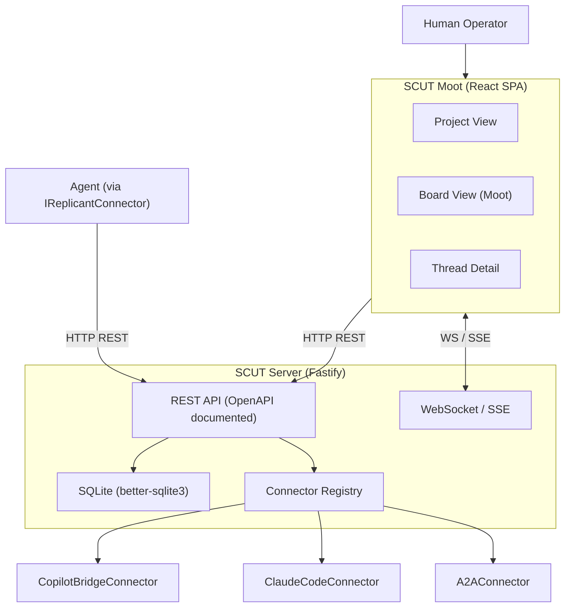
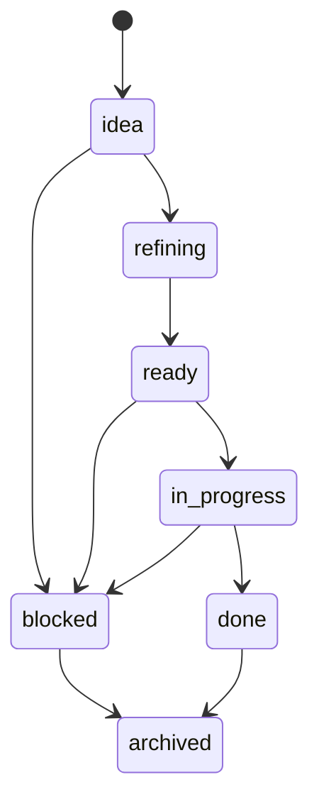
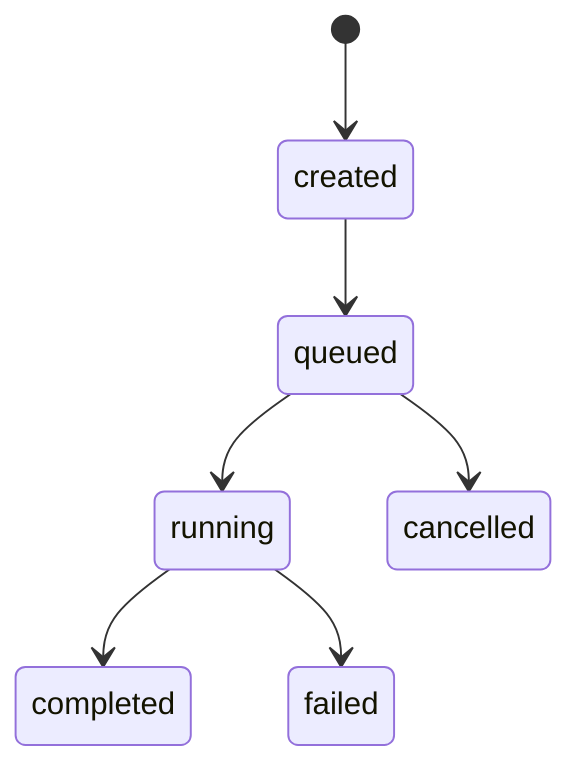
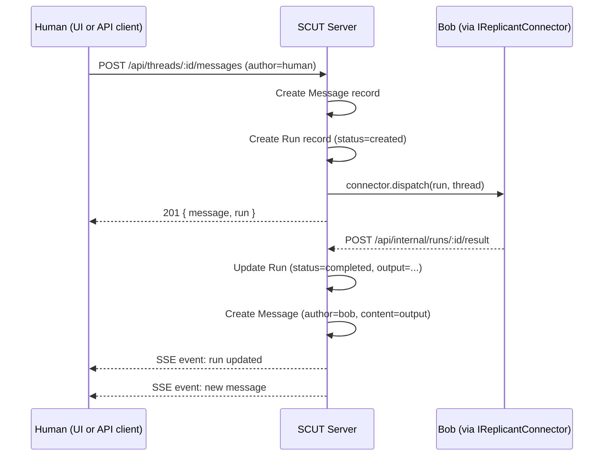

# SCUT - Design Specification

## Table of Contents

1. [Executive Summary](#1-executive-summary)
2. [Design Principles](#2-design-principles)
3. [Vocabulary](#3-vocabulary)
4. [Application Architecture](#4-application-architecture)
5. [Data Hierarchy](#5-data-hierarchy)
6. [Data Model](#6-data-model)
7. [Real-Time and Bidirectional Data](#7-real-time-and-bidirectional-data)
8. [Connector Interface](#8-connector-interface)
9. [API Surface](#9-api-surface)
10. [Connector Implementations (Planned)](#10-connector-implementations-planned)
11. [Phase Plan](#11-phase-plan)

---

## 1. Executive Summary

SCUT (Structured Coordination Utility for Tasks) is an agnostic multi-agent coordination plane: a project and task management system where every unit of work is also a discrete agent session. SCUT maintains a full hierarchy of work (Organizations > Projects > Boards > Columns > Threads), tracks each agent invocation (Runs), stores conversation history (Messages), and provides a board view (the Moot) where humans can assign, monitor, and review work across all registered agents (Bobs).

SCUT is API-first. The UI is a consumer of the API, not a privileged client. An agent can do everything a human can: create a project, move a thread, add a comment, dispatch a run, reorganize a board. The REST API is the system's contract, and it is fully documented (OpenAPI) and updated alongside every new endpoint.

SCUT is not an agent framework, does not run language models, and does not replace copilot-bridge or any other harness - it is the coordination plane that sits above them.

---

## 2. Design Principles

### API-First

Every entity in SCUT is fully addressable via REST API. The React UI is one client of that API. An agent connector is another. A CLI tool could be a third. No capability exists only in the UI.

Consequences:
- Every create/read/update/delete operation has a corresponding API endpoint
- API is documented (OpenAPI 3.1) and the docs are generated from code
- API schema is the source of truth; UI is derived from it
- Agents can reorganize boards, move cards, create projects, and dispatch runs - all via API

### Thread = Agent Session

Opening a Thread is opening a persistent agent session. The full message history is the context. A Run is one turn in that session - dispatched to whichever Bob is currently assigned. Reassigning a Bob mid-thread is valid; the new Bob receives the full history as context.

### Metadata as First-Class

Every entity carries a `metadata` JSON field. This is intentional: it enables filtering, custom views, tagging, labeling, and priority without schema changes. Standard fields (priority, labels, estimate) are conventions on top of metadata, not columns.

### Hierarchy Owned by SCUT, Not the Board

The board (Moot) is a view - a filtered projection of Threads. The data hierarchy (Project > Board > Column > Thread) is owned by the database. Multiple board views can exist over the same set of Threads. Columns are logical groupings (by status, by label, by Bob), not containers.

---

## 3. Vocabulary

| Term | What it is |
|------|------------|
| **Organization** | Top-level tenant. Owns projects and Bobs. Phase 1 assumes single-org. |
| **Project** | A named collection of Boards and Threads. Roughly equivalent to a repo or initiative. |
| **Board** | A named view within a Project. Displays Threads organized into Columns. |
| **Column** | A logical grouping of Threads on a Board. Defined by a filter (status, label, etc.). |
| **Thread** | The unit of work. A card on a board and a persistent agent session. |
| **Message** | One turn in a Thread's conversation - from a human, a Bob, or the system. |
| **Run** | One invocation of a Bob against a Thread. Tracks status, input, and output. |
| **Bob** | A registered agent connector instance. Named after the Bobiverse replicants. |
| **Moot** | The React board UI. Where humans see and manage Threads across Projects and Boards. |
| **IReplicantConnector** | The harness-agnostic connector interface every Bob adapter implements. |
| **CopilotBridgeConnector** | Phase 1 reference implementation of `IReplicantConnector` for copilot-bridge. |
| **ClaudeCodeConnector** | Phase 3 connector for the `claude` CLI via subprocess. |
| **SubprocessConnector** | Phase 3 generic connector for any CLI-based agent harness. |
| **A2AConnector** | Phase 3 connector for remote agents via the Google A2A protocol. |
| **ACPConnector** | Phase 4 connector for local agents via the IBM ACP protocol. |

The pattern: `Bob` is the entity. `IReplicantConnector` is the interface. Each `*Connector` is one harness adapter.

---

## 4. Application Architecture

### Web Application Model

SCUT is a **SPA + API server** (not SSR):

- **`packages/server`** - Fastify API server. Owns the database, business logic, connector registry, and serves the built UI as static files in production.
- **`packages/ui`** - React + Vite SPA. Fetches all data from the Fastify API. No server-side rendering.

This model is chosen because:
- A persistent backend is required regardless (SQLite, connector registry, agent proxying, SSE/WebSocket)
- SSR adds complexity without benefit here - this is an operator tool, not a public site
- The API-first principle is cleanest when the UI and API are fully decoupled

In development, Vite proxies `/api` requests to the Fastify server. In production, Fastify serves the Vite build as static files and handles all `/api` routes.

### System Architecture



### API Documentation

Every endpoint is documented via OpenAPI 3.1. The spec is generated from Fastify's JSON schema validation and served at `/api/docs` (Scalar or Swagger UI). The OpenAPI spec file is committed to the repo at `docs/api/openapi.yaml` and updated with every PR that adds or changes endpoints. Agents and humans use the same docs.

---

## 5. Data Hierarchy

SCUT borrows from established project management taxonomy (Linear, Jira, GitHub Projects) and adapts it to multi-agent coordination:

```
Organization
  └── Project (e.g. "scut", "website-redesign")
        └── Board (e.g. "Sprint 1", "Backlog", "Agent Tasks")
              └── Column (logical grouping: by status, label, or custom filter)
                    └── Thread (card + agent session)
                          ├── Message (human or Bob turn)
                          └── Run (one Bob invocation)
```

### Comparison to Common Tools

| SCUT | Linear | Jira | GitHub Projects |
|------|--------|------|-----------------|
| Organization | Workspace | Organization | Organization |
| Project | Team/Project | Project | Project |
| Board | Project View | Board | View |
| Column | Status group | Column | Column |
| Thread | Issue | Story/Task | Item |
| Message | Comment | Comment | Comment |
| Run | (none) | (none) | (none - SCUT-specific) |
| Bob | (none) | (none) | (none - SCUT-specific) |
| Metadata | Labels + custom fields | Custom fields | Custom fields |

Key difference from all of the above: in SCUT, a Thread is also a **persistent agent session**. A Run is a discrete agent invocation within that session. No other tool in this list has a native concept of dispatching work to an agent and tracking the result as a first-class data entity.

### Metadata Convention

All entities carry a `metadata` JSON field. Standard conventions (not enforced by schema):

| Key | Type | Meaning |
|-----|------|---------|
| `priority` | `"low" \| "medium" \| "high" \| "critical"` | Work priority |
| `labels` | `string[]` | Free-form tags for filtering |
| `estimate` | `number` | Story points or time estimate |
| `due_date` | ISO 8601 string | Target completion |
| `epic` | `string` | Parent epic identifier |

Agents and UIs can filter, sort, and build views using any metadata key. The API supports metadata filter queries.

---

## 6. Data Model

### 6.1 Entity Overview

| Entity | Parent | Description |
|--------|--------|-------------|
| **Organization** | - | Top-level tenant. Phase 1: single org, config only. |
| **Project** | Organization | Named collection of boards and threads. |
| **Board** | Project | Named view. Displays threads in columns. |
| **Column** | Board | Logical grouping defined by a filter rule. |
| **Thread** | Project (+ optionally pinned to a Board Column) | Unit of work and agent session. |
| **Message** | Thread | One conversation turn. |
| **Run** | Thread | One Bob invocation. |
| **Bob** | Organization | Registered agent connector instance. |

### 6.2 SQL Schema

```sql
-- Projects
CREATE TABLE IF NOT EXISTS projects (
  id          TEXT PRIMARY KEY,
  name        TEXT NOT NULL UNIQUE,
  description TEXT NOT NULL DEFAULT '',
  metadata    TEXT NOT NULL DEFAULT '{}',
  created_at  TEXT NOT NULL DEFAULT (datetime('now')),
  updated_at  TEXT NOT NULL DEFAULT (datetime('now'))
);

-- Boards (named views within a project)
CREATE TABLE IF NOT EXISTS boards (
  id          TEXT PRIMARY KEY,
  project_id  TEXT NOT NULL REFERENCES projects(id) ON DELETE CASCADE,
  name        TEXT NOT NULL,
  description TEXT NOT NULL DEFAULT '',
  metadata    TEXT NOT NULL DEFAULT '{}',
  created_at  TEXT NOT NULL DEFAULT (datetime('now')),
  updated_at  TEXT NOT NULL DEFAULT (datetime('now'))
);

-- Columns (logical groupings on a board, defined by a filter rule)
CREATE TABLE IF NOT EXISTS columns (
  id          TEXT PRIMARY KEY,
  board_id    TEXT NOT NULL REFERENCES boards(id) ON DELETE CASCADE,
  name        TEXT NOT NULL,
  position    INTEGER NOT NULL DEFAULT 0,
  filter_rule TEXT NOT NULL DEFAULT '{}', -- JSON: { status?, labels?, bob_id? }
  metadata    TEXT NOT NULL DEFAULT '{}',
  created_at  TEXT NOT NULL DEFAULT (datetime('now')),
  updated_at  TEXT NOT NULL DEFAULT (datetime('now'))
);

-- Registered Bob connectors (agent harness instances)
CREATE TABLE IF NOT EXISTS bobs (
  id          TEXT PRIMARY KEY,
  name        TEXT NOT NULL UNIQUE,
  harness     TEXT NOT NULL,              -- copilot-bridge | claude-code | subprocess | a2a | acp
  config      TEXT NOT NULL DEFAULT '{}', -- JSON connector config (harness-specific)
  status      TEXT NOT NULL DEFAULT 'unknown', -- online | offline | busy | unknown
  metadata    TEXT NOT NULL DEFAULT '{}',
  created_at  TEXT NOT NULL DEFAULT (datetime('now')),
  updated_at  TEXT NOT NULL DEFAULT (datetime('now'))
);

-- Threads: unit of work and persistent agent session
CREATE TABLE IF NOT EXISTS threads (
  id          TEXT PRIMARY KEY,
  project_id  TEXT NOT NULL REFERENCES projects(id) ON DELETE CASCADE,
  title       TEXT NOT NULL,
  description TEXT NOT NULL DEFAULT '',
  status      TEXT NOT NULL DEFAULT 'idea', -- idea | refining | ready | in_progress | blocked | done | archived
  bob_id      TEXT REFERENCES bobs(id) ON DELETE SET NULL,
  metadata    TEXT NOT NULL DEFAULT '{}',
  created_at  TEXT NOT NULL DEFAULT (datetime('now')),
  updated_at  TEXT NOT NULL DEFAULT (datetime('now'))
);

-- Messages: conversation history on a thread
CREATE TABLE IF NOT EXISTS messages (
  id          TEXT PRIMARY KEY,
  thread_id   TEXT NOT NULL REFERENCES threads(id) ON DELETE CASCADE,
  run_id      TEXT REFERENCES runs(id) ON DELETE SET NULL,
  author      TEXT NOT NULL,              -- human | bob | system
  author_id   TEXT,
  content     TEXT NOT NULL,
  metadata    TEXT NOT NULL DEFAULT '{}',
  created_at  TEXT NOT NULL DEFAULT (datetime('now'))
);

-- Runs: one invocation of a Bob against a Thread
CREATE TABLE IF NOT EXISTS runs (
  id           TEXT PRIMARY KEY,
  thread_id    TEXT NOT NULL REFERENCES threads(id) ON DELETE CASCADE,
  bob_id       TEXT NOT NULL REFERENCES bobs(id) ON DELETE RESTRICT,
  status       TEXT NOT NULL DEFAULT 'created', -- created | queued | running | completed | failed | cancelled
  input        TEXT NOT NULL DEFAULT '',
  output       TEXT,
  error        TEXT,
  started_at   TEXT,
  completed_at TEXT,
  metadata     TEXT NOT NULL DEFAULT '{}',
  created_at   TEXT NOT NULL DEFAULT (datetime('now')),
  updated_at   TEXT NOT NULL DEFAULT (datetime('now'))
);

-- Indexes
CREATE INDEX IF NOT EXISTS idx_boards_project    ON boards(project_id);
CREATE INDEX IF NOT EXISTS idx_columns_board     ON columns(board_id);
CREATE INDEX IF NOT EXISTS idx_threads_project   ON threads(project_id);
CREATE INDEX IF NOT EXISTS idx_threads_status    ON threads(status);
CREATE INDEX IF NOT EXISTS idx_threads_bob       ON threads(bob_id);
CREATE INDEX IF NOT EXISTS idx_messages_thread   ON messages(thread_id);
CREATE INDEX IF NOT EXISTS idx_messages_run      ON messages(run_id);
CREATE INDEX IF NOT EXISTS idx_runs_thread       ON runs(thread_id);
CREATE INDEX IF NOT EXISTS idx_runs_status       ON runs(status);
```

### 6.3 Thread Status Flow



### 6.4 Run Status Flow



---

## 7. Real-Time and Bidirectional Data

### Model

SCUT uses **Server-Sent Events (SSE)** for server-to-client push (run status updates, new messages, thread status changes). SSE is sufficient for Phase 1 and 2 because the primary real-time flow is one-way: the server notifying the UI of agent results.

For bidirectional needs (human typing a message while a run is in progress, collaborative editing), **WebSockets** are the Phase 3 upgrade path. The API design does not prevent this - SSE and WebSocket endpoints are additive.

### Event Streams

| Endpoint | Scope | Events emitted |
|----------|-------|----------------|
| `GET /api/threads/:id/events` | Single thread | `message`, `run`, `thread` |
| `GET /api/projects/:id/events` | Whole project | `thread_created`, `thread_updated`, `run_updated` |

### Bidirectional Flow: Thread as Agent Session



The same flow works for an agent client: the agent POSTs a message to the API just like the human UI does.

---


## 8. Connector Interface

Every Bob connector implements `IReplicantConnector`. The interface is intentionally thin: SCUT's job is to route and track, not to dictate how the harness works internally.

```typescript
export type BobStatus = {
  available: boolean;
  busy: boolean;
  detail?: string;
};

export type Thread = {
  id: string;
  projectId: string;
  title: string;
  description: string;
  status: string;
  bobId: string | null;
  metadata: Record<string, unknown>;
  createdAt: string;
  updatedAt: string;
};

export type Run = {
  id: string;
  threadId: string;
  bobId: string;
  status: 'created' | 'queued' | 'running' | 'completed' | 'failed' | 'cancelled';
  input: string;
  output: string | null;
  error: string | null;
  startedAt: string | null;
  completedAt: string | null;
  createdAt: string;
  updatedAt: string;
};

export interface IReplicantConnector {
  /**
   * Dispatch a Run to the Bob. Fire-and-forget.
   * Resolves when the run has been accepted (queued or started), not when complete.
   * The connector posts the result back via POST /api/internal/runs/:id/result.
   */
  dispatch(run: Run, thread: Thread): Promise<void>;

  /**
   * Cancel an in-progress or queued Run.
   * Should resolve even if the Run has already completed.
   */
  cancel(runId: string): Promise<void>;

  /**
   * Return the current health and availability of the Bob.
   */
  status(): Promise<BobStatus>;
}
```

### 8.1 Connector Contract Notes

- `dispatch` is fire-and-forget. SCUT creates the Run record before calling dispatch. The connector may update the Run status to `queued` or `running` synchronously, but the result arrives later via the callback.
- `cancel` is best-effort. Some harnesses may not support mid-run cancellation. Connectors should set Run status to `cancelled` and resolve without throwing if cancellation is not possible.
- `status` is called periodically by SCUT to update the Bob's availability in the `bobs` table. It should be cheap and non-blocking.

---

## 9. API Surface

All endpoints return JSON. Error responses use `{ error: string, code?: string }`. The full OpenAPI 3.1 spec is served at `/api/docs` and committed to `docs/api/openapi.yaml`.

### 9.1 Projects

| Method | Path | Description |
|--------|------|-------------|
| `GET` | `/api/projects` | List all projects |
| `POST` | `/api/projects` | Create a project |
| `GET` | `/api/projects/:id` | Get project by ID |
| `PATCH` | `/api/projects/:id` | Update project |
| `DELETE` | `/api/projects/:id` | Archive project |
| `GET` | `/api/projects/:id/events` | SSE stream for whole project |

### 9.2 Boards

| Method | Path | Description |
|--------|------|-------------|
| `GET` | `/api/projects/:id/boards` | List boards in project |
| `POST` | `/api/projects/:id/boards` | Create board |
| `GET` | `/api/boards/:id` | Get board by ID (with columns) |
| `PATCH` | `/api/boards/:id` | Update board |
| `DELETE` | `/api/boards/:id` | Delete board |

### 9.3 Columns

| Method | Path | Description |
|--------|------|-------------|
| `GET` | `/api/boards/:id/columns` | List columns on a board |
| `POST` | `/api/boards/:id/columns` | Create column |
| `PATCH` | `/api/columns/:id` | Update column (name, position, filter) |
| `DELETE` | `/api/columns/:id` | Delete column |

### 9.4 Threads

| Method | Path | Description |
|--------|------|-------------|
| `GET` | `/api/projects/:id/threads` | List threads in project (filterable) |
| `POST` | `/api/projects/:id/threads` | Create thread |
| `GET` | `/api/threads/:id` | Get thread (with messages, latest run) |
| `PATCH` | `/api/threads/:id` | Update thread (status, bobId, metadata, etc.) |
| `DELETE` | `/api/threads/:id` | Archive thread |
| `GET` | `/api/threads/:id/events` | SSE stream for single thread |

Query params for `GET /api/projects/:id/threads`: `status`, `bobId`, `label`, `metadata.*` (arbitrary metadata filter).

### 9.5 Messages

| Method | Path | Description |
|--------|------|-------------|
| `GET` | `/api/threads/:id/messages` | List messages on a thread |
| `POST` | `/api/threads/:id/messages` | Add message (triggers Run if Bob assigned) |

### 9.6 Runs

| Method | Path | Description |
|--------|------|-------------|
| `GET` | `/api/threads/:id/runs` | List runs for a thread |
| `POST` | `/api/threads/:id/runs` | Manually dispatch a run |
| `DELETE` | `/api/runs/:id` | Cancel a run |

### 9.7 Bobs

| Method | Path | Description |
|--------|------|-------------|
| `GET` | `/api/bobs` | List all Bobs with status |
| `POST` | `/api/bobs` | Register a Bob |
| `GET` | `/api/bobs/:id` | Get Bob by ID |
| `PATCH` | `/api/bobs/:id` | Update Bob config |
| `DELETE` | `/api/bobs/:id` | Deregister Bob |

### 9.8 Internal (Connector Callback)

#### `POST /api/internal/runs/:id/result`

Used by connectors to post results back to SCUT after a Run completes.

Request body:
```json
{
  "status": "completed | failed | cancelled",
  "output": "string (present if status=completed)",
  "error": "string (present if status=failed)"
}
```

Side effects: updates Run, creates Message (author=bob), emits SSE events.

---

## 10. Connector Implementations (Planned)

### `CopilotBridgeConnector`

Wraps the copilot-bridge HTTP channel adapter. Translates a Run into a copilot-bridge channel invocation. Results come back via the bridge's existing webhook/callback mechanism, forwarded to SCUT's internal result endpoint.

- Harness type: `copilot-bridge`
- Transport: HTTP (copilot-bridge's own API)
- Status: Phase 1 target

### `ClaudeCodeConnector`

Drives the `claude` CLI via subprocess. Launches `claude` with the Run input as a prompt, captures stdout as the result, and posts to the result callback. Supports cancellation via process kill.

- Harness type: `claude-code`
- Transport: subprocess (stdin/stdout)
- Status: Phase 3 target

### `SubprocessConnector`

Generic subprocess connector. Launches a configurable command with the Run input on stdin, reads the result from stdout. Enables any CLI-based agent to be connected with minimal configuration.

- Harness type: `subprocess`
- Transport: subprocess (stdin/stdout)
- Config: `{ command: string, args: string[] }`
- Status: Phase 3 target

### `A2AConnector`

Connects to a remote agent via the Google A2A (Agent-to-Agent) protocol. Translates a Run into an A2A task submission. Polls or subscribes to A2A task status updates and posts results back to SCUT's callback endpoint.

- Harness type: `a2a`
- Transport: HTTP + A2A protocol
- Config: `{ agentCardUrl: string, auth?: object }`
- Status: Phase 3 target

### `ACPConnector`

Connects to a local agent via the IBM ACP (Agent Communication Protocol). Designed for locally-running agents (local LLMs, edge services).

- Harness type: `acp`
- Transport: HTTP + ACP protocol
- Config: `{ baseUrl: string }`
- Status: Phase 4 target

---

## 11. Phase Plan

### Phase 1 - MVP

**Goal:** A working board where you can create projects, boards, threads, assign a Bob, and see results.

**Deliverables:**
- Full data model: Project / Board / Column / Thread / Message / Run / Bob
- SQLite database with migration runner
- Fastify API: all endpoints in section 9 (Projects, Boards, Columns, Threads, Messages, Runs, Bobs - excluding SSE)
- OpenAPI 3.1 spec served at `/api/docs`, committed to `docs/api/openapi.yaml`
- `CopilotBridgeConnector` as the Phase 1 reference `IReplicantConnector` implementation
- Basic React SPA (Moot): project list, board view with columns, thread detail, Bobs page
- Manual Bob registration via API or seed script

**Success criteria:** A human can create a project, create a board with columns, create a thread, assign it to a Bob, add a message, and see the Bob's result appear in the thread history.

### Phase 2 - Real-Time and Run Tracking

**Goal:** Live board updates and run lifecycle visibility.

**Deliverables:**
- SSE event stream (`GET /api/threads/:id/events`)
- Moot UI updates in real-time without polling
- Run status display in thread detail (timeline view)
- Bob status polling and display in Bob list

**Success criteria:** When a Bob completes a run, the thread detail updates in the browser without a page refresh.

### Phase 3 - Multi-Harness

**Goal:** Connect Claude Code and Codex via subprocess. Connect a remote A2A agent.

**Deliverables:**
- `SubprocessConnector` (generic)
- `ClaudeCodeConnector` (uses SubprocessConnector with claude CLI)
- `A2AConnector`
- Moot UI: Bob type selector when assigning a Bob to a thread
- Run input editing before dispatch

**Success criteria:** A thread can be reassigned from a `CopilotBridgeConnector` Bob to a `ClaudeCodeConnector` Bob mid-conversation, and the new Bob picks up from the thread history.

### Phase 4 - Local-First and Parallel Dispatch

**Goal:** ACP support and multi-Bob parallelism.

**Deliverables:**
- `ACPConnector`
- Parallel dispatch: send a Thread to multiple Bobs simultaneously, compare results
- Thread branching: fork a thread to explore two approaches in parallel
- Moot UI: parallel run comparison view

**Success criteria:** A thread can be dispatched to two different Bobs simultaneously, and the Moot shows both results side-by-side for human review.
